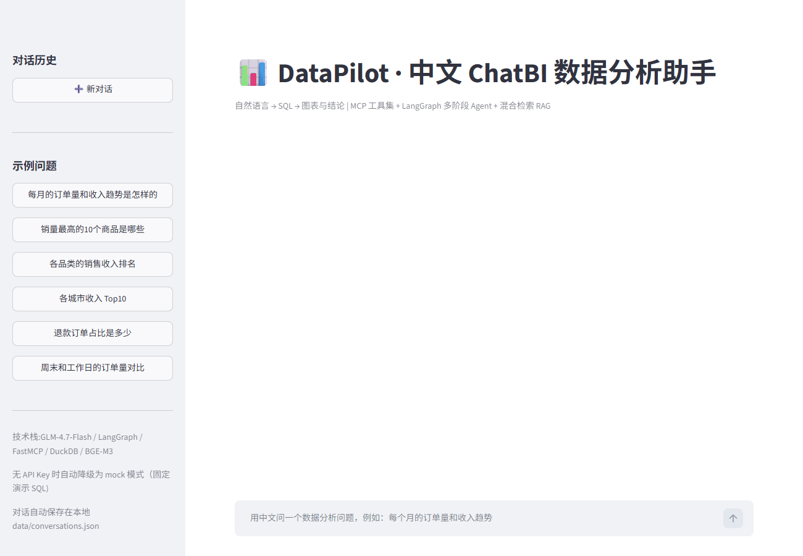

# DataPilot

### Context-aware Conversational Text-to-SQL / ChatBI

A Chinese ChatBI / Text-to-SQL assistant that turns natural-language questions into read-only SQL, charts, and iterative analysis.

> Chinese question → auto-select tables & columns → generate and self-repair SQL → execute read-only → chart + conclusion.

**Python · LangGraph · MCP · FastAPI · Streamlit · DuckDB**

## Overview

DataPilot is an end-to-end ChatBI project covering **Text-to-SQL**, **hybrid-retrieval RAG**, the **MCP tool protocol**, a **LangGraph multi-stage agent**, **multi-turn conversational analysis**, and **systematic evaluation**. It runs against a small, deterministic e-commerce demo database (DuckDB) and works fully offline in mock mode for development and CI.

## Features

- **Multi-stage workflow with a local agent loop** — the main path is a fixed pipeline (clarify → schema linking → few-shot → generate → validate → execute → report), which is controllable, testable, and token-efficient. Control is handed back to the LLM only when SQL validation or execution fails, for self-repair (≤ 3 rounds).

- **Multi-turn conversational analysis** — follow-ups such as "只看前 3 个" and "改成折线图" reuse the previous turn's **structured analytical context** (SQL, result, chart) together with a compact window of **conversation history**, so each turn adjusts incrementally instead of re-answering from scratch. Sessions are isolated and persisted to a local JSON file.

- **Hybrid retrieval for schema linking and few-shot selection** — schema metadata and similar question→SQL pairs are retrieved independently using BM25 + vector dual recall, then fused with RRF.

- **MCP tool protocol** — the database capability is exposed as 5 standard MCP tools (FastMCP), available both in-process and through a stdio MCP server.

- **Read-only safety** — statement-count, leading-keyword, and word-boundary keyword checks, plus an `EXPLAIN` pre-check that finds syntax/column errors without executing; the failure signal also feeds the repair loop.

- **Systematic evaluation** — a 40-question mini benchmark measures execution accuracy (EX), exec rate, table recall@k, self-repair success, P50/P95 latency, and per-query tokens, with one-command component ablations.

- **Vendor-agnostic** — all LLM/embedding calls use OpenAI-compatible endpoints; switch providers with environment variables only.

- **Offline-runnable** — a built-in deterministic mock LLM/embedding lets the full pipeline, tests, and CI run with no API key.

## Architecture

```mermaid
flowchart TB
    U[Chinese question<br/>first or follow-up] --> C[Clarify<br/>ask only when ambiguous]
    C -->|answerable| R[Schema Linking<br/>BM25 + vector + RRF]
    C -->|needs clarification| U
    R --> F[Few-shot retrieval<br/>similar question→SQL pairs]
    F --> G[SQL generation<br/>GLM-4.7-Flash]
    G --> V{EXPLAIN + read-only check}
    V -->|fail| P[Self-repair ≤ 3 rounds<br/>error fed back] --> G
    V -->|pass| E[Execute SQL<br/>DuckDB read-only]
    E -->|error| P
    E -->|ok| B[Report<br/>conclusion + chart type]
    B --> O[Conclusion + chart + metrics]

    subgraph S[Conversation State]
        direction LR
        H[Conversation History<br/>recent messages, compacted]
        X[Analytical Context<br/>last SQL / result / chart]
    end
    O -.->|stores last result| X
    H -.->|follow-up reuses| G
    X -.->|follow-up reuses| G

    subgraph MCP tools
        T1[list_tables] T2[get_schema] T3[sample_rows] T4[validate_sql] T5[execute_sql]
    end
    R -.->|in-process| T2
    E -.->|in-process| T5
```

## How It Works

1. **Clarify** — decide whether the question is unambiguous under the given schema; default to a sensible interpretation rather than over-asking.
2. **Schema linking** — hybrid retrieval (BM25 + vector, RRF) selects the relevant tables/columns into a compact schema.
3. **Few-shot retrieval** — retrieve similar question→SQL pairs to align output style (JOIN conventions, aliases, `LIMIT`).
4. **Generate** — the LLM writes a single SQL statement.
5. **Validate** — `EXPLAIN` + read-only keyword checks, without executing.
6. **Repair loop (≤ 3 rounds)** — on failure, the error is fed back and the SQL is regenerated.
7. **Execute & report** — the SQL runs read-only; the result is summarized with a chart suggestion.

## Multi-turn Conversational Analysis

Follow-up questions are handled by carrying two distinct kinds of state into the next turn:

- **Conversation history** — the most recent few turns of user/assistant messages (compacted; assistant answers trimmed to their first sentence).
- **Structured analytical context** — the previous turn's analysis object: question, generated SQL, chart type, result columns/rows, and linked tables.

Both are appended as prompt blocks, so the model adjusts the previous query incrementally instead of answering from scratch. Each session is isolated and persisted to a local JSON file (`app/conversation_store.py`).

**Example** — one session, three turns:

| Turn | User question | Result |
|---|---|---|
| 1 | 哪个商品类别的销售额最高？ | generates SQL → executes → answer + bar chart |
| 2 | 只看前 3 个 | reuses turn-1 context → `LIMIT 3` → updated answer + chart |
| 3 | 改成折线图 | reuses turn-2 context → chart type changes to line |

**Verified end-to-end** (offline mock mode, `scripts/_verify_multiturn.py`): the first question establishes structured context, a follow-up reuses it without error, **新对话** fully clears messages + context and issues a new id, and reopening a historical session restores its messages + context. The full test suite passes (**83 passed**) and `ruff check` is clean (**All checks passed**).

## Demo



> `docs/multiturn-demo.gif` is a **real screen recording** of the Streamlit UI (GLM-4.7-Flash + DuckDB):
> "各品类的销售收入排名" → bar chart → "只看前3个" → narrowed bar chart → "改成折线图" → line chart.
> Each follow-up waits for the real result before continuing.

The interactive UI is `app/streamlit_app.py` (Streamlit), with example questions, chat-style interaction, expandable SQL, charts (bar/line/area), and run metrics.

## Installation

Requires Python ≥ 3.10.

```bash
# Runtime
pip install -e .

# Development / testing
pip install -e ".[dev]"

# Optional QLoRA training dependencies
pip install -e ".[training]"
```

## Configuration

All settings come from environment variables (see `.env.example`). No API key is committed to the repository.

| Variable | Description |
|---|---|
| `DATAPILOT_LLM_PROVIDER` | Primary LLM provider (default `zhipu`) |
| `DATAPILOT_LLM_API_KEY` | Primary LLM API key |
| `DATAPILOT_LLM_BASE_URL` | Primary LLM base URL (default `https://open.bigmodel.cn/api/paas/v4`) |
| `DATAPILOT_LLM_MODEL` | Primary LLM model (default `glm-4.7-flash`) |
| `DATAPILOT_LLM2_PROVIDER` / `DATAPILOT_LLM2_API_KEY` / `DATAPILOT_LLM2_BASE_URL` / `DATAPILOT_LLM2_MODEL` | Secondary LLM endpoint for ablation (default SiliconFlow `Qwen/Qwen2.5-7B-Instruct`) |
| `DATAPILOT_EMBED_PROVIDER` / `DATAPILOT_EMBED_API_KEY` / `DATAPILOT_EMBED_BASE_URL` / `DATAPILOT_EMBED_MODEL` | Embedding endpoint (default SiliconFlow `BAAI/bge-m3`) |
| `DATAPILOT_DB_PATH` | Database path (default `data/ecommerce.duckdb`) |
| `DATAPILOT_RETRIEVAL_TOP_K` | Retrieval top-k (default `5`) |
| `DATAPILOT_MAX_REPAIR_ROUNDS` | Max SQL repair rounds (default `3`) |
| `DATAPILOT_MOCK` | `1` to force offline mock mode (default `0`) |

## Quick Start

```bash
# 1. install
pip install -e .

# 2. build the demo database (~100k orders, deterministic seed)
python -m server.core.seed_data --rows 100000

# 3a. offline mock mode (no API key; deterministic demo SQL)
DATAPILOT_MOCK=1 streamlit run app/streamlit_app.py
# Windows:
# set DATAPILOT_MOCK=1 && streamlit run app/streamlit_app.py

# 3b. real mode: copy .env.example to .env and fill in DATAPILOT_LLM_API_KEY
streamlit run app/streamlit_app.py

# HTTP API
uvicorn server.api.main:app --port 8000
# POST /api/query {"question": "每月订单量"}

# or Docker (API :8000 + demo :8501)
docker compose up --build
```

## Evaluation

The evaluation includes a 40-question mini benchmark plus component ablations to measure the contribution of schema linking, few-shot retrieval, and self-repair. The reported benchmark uses the real LLM pipeline, not mock mode.

```bash
python -m eval.mini_runner --label baseline
python -m eval.mini_runner --no-linking --label no-linking
python -m eval.mini_runner --no-fewshot --label no-fewshot
python -m eval.mini_runner --max-repair 0 --label no-repair
python -m eval.mini_runner --llm llm2 --label qwen7b

# CSpider benchmark support (download data first)
python -m eval.download_cspider
python -m eval.runner --split dev --limit 300 --label baseline
```

Results are written to `eval/results/*.json`. The numbers below are read from those JSON files.

| Config | EX | Exec rate | Repair success | P50 | P95 | Avg tokens |
|---|---:|---:|---:|---:|---:|---:|
| baseline (GLM-4.7-Flash, full pipeline) | **0.800** (32/40) | 0.975 | 0.833 | 8.4s | 39.7s | 1294 |
| − schema linking | 0.800 | 1.000 | 1.000 | 40.6s | 266.2s | 1224 |
| − few-shot | 0.400 | 0.975 | 0.750 | 119.8s | 307.9s | 1070 |
| − self-repair | 0.700 | 0.825 | — | 198.0s | 424.3s | 1079 |
| Qwen2.5-7B (free API) | **0.850** (34/40) | 0.950 | 0.333 | 6.6s | 14.1s | 1322 |

> - **Latency caveat**: P50/P95 are wall-clock time and are contaminated by free-tier API rate-limiting on some rows (no-linking / no-fewshot / no-repair were throttled, hence 40–424s). They do not represent model compute speed and should not be compared across rows. Unthrottled runs are P50 ≈ 6–8s.
> - **Ablation takeaways**: few-shot retrieval has the largest measured impact (0.800 → 0.400 without it); self-repair is the second largest (0.800 → 0.700, exec rate 0.975 → 0.825); schema linking shows no EX improvement on this small schema (0.800 vs 0.800).
> - **Model comparison**: Qwen2.5-7B achieved 0.850 EX (34/40) vs 0.800 (32/40) for the baseline on this 40-question benchmark. The small difference should not be treated as statistically significant.
> - A small number of gold annotations that filtered refunds while the question did not ask for it were corrected through a documented override file (`data/eval_corrections.json`, loaded by `eval/annotations.py`). The original benchmark `data/mini_eval.jsonl` is untouched. See `docs/evaluation_notes.md`.
> - **CSpider benchmark support**: a runner is included, but CSpider dev results are not included in the reported results above.

## Project Structure

```text
datapilot/
├── server/
│   ├── core/          # config, LLM client, embeddings, DuckDB/SQLite adapters, seed data
│   ├── mcp_tools/     # FastMCP tools (single ToolCore implementation)
│   ├── retrieval/     # hybrid retrieval (BM25+vector RRF), schema linking, few-shot
│   ├── agents/        # LangGraph pipeline: clarify → linking → generate → repair → report
│   └── api/           # FastAPI entry point
├── eval/              # mini benchmark + CSpider runner (EX, recall, repair, latency, tokens)
├── training/          # SFT data build / QLoRA training / merge-export (not trained — see Notes)
├── app/               # Streamlit demo
├── scripts/            # mcp_smoke.py (MCP protocol smoke test)
├── tests/              # pytest (offline mock mode)
├── data/               # benchmark files (mini_eval.jsonl, fewshot_examples.jsonl)
├── docs/               # evaluation notes, experiments, fine-tuning guide
├── Dockerfile / docker-compose.yml
└── pyproject.toml / .env.example / .gitignore
```

## Limitations

- **QLoRA is not trained** — the `training/` scripts are complete but have never been run: no adapter, no results, no fine-tuning comparison (see Notes).
- **Evaluation scope** — the headline EX numbers come from a 40-question mini benchmark on the demo database, not the full CSpider dev set.
- **Latency noise** — free-tier rate-limiting contaminates P50/P95 on some rows.
- **Demo** — the primary demo is a real screen recording (`docs/multiturn-demo.gif`); `docs/demo.png` is a static visualization of one real query result.

## Notes

### Experimental Training Pipeline

The repository includes a QLoRA fine-tuning pipeline under `training/`. The pipeline has not been trained or evaluated and is not included in the reported experimental results.

- The CI workflow (ruff + seed data + pytest, mock mode) is defined in `.github/workflows/ci.yml`.
- Evaluation methodology and correction rationale: `docs/evaluation_notes.md`, `docs/final_evaluation_report.md`.

## License

[MIT](LICENSE)